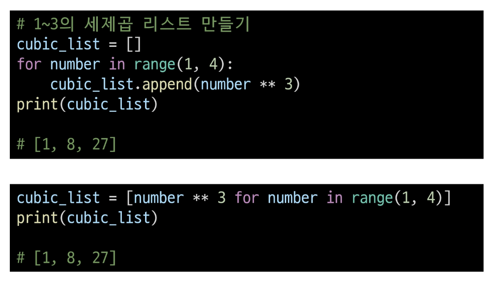
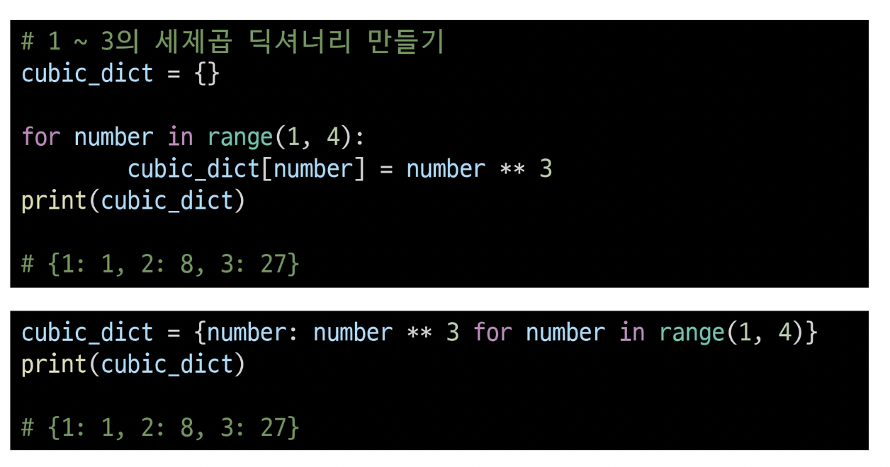
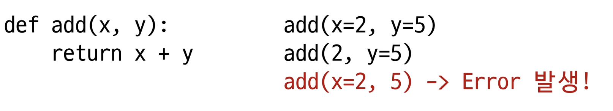
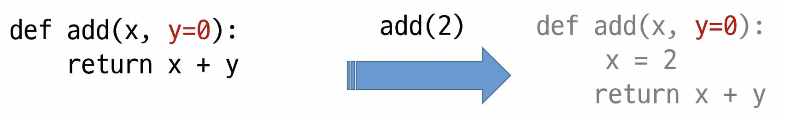
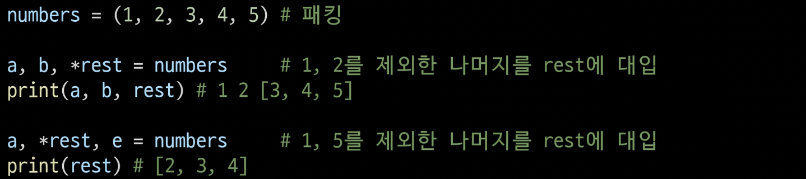

# 파이썬

---

## day03, 7월 20일 수요일

---

## 제어문

#### 조건문

- 참/거짓을 판단할 수 있는 조건식과 함께 사용
- If, elif, else

#### 중첩 조건문

### 조건 표현식

- 왼참오거, true인 경우 if 조건에 해당하는 내용 출력
- Ex value = num if num >= 0 else -num

### 반복문

특정 조건을 만족할 때까지 같은 동작을 계속 반복하고 싶을 때 사용

### 딕셔너리

**딕셔너리 순회**

- keys()
- Values()
- Items()
- Enumerate()
  - 인덱스와 객체를 쌍으로 담은 열거형 객체 반환, (index, value)형태의 튜플

**리스트 컴프리헨션**

[code for 변수 in iterable]

[code for 변수 in iterable if 조건식]

**딕셔너리 컴프리헨션**

{key: value for 변수 in iterable}

{key: value for 변수 in iterable if 조건식}

### 반복문 제어

- Break - 반복문을 종료
- Continue - continue 이후 코드 블록은 수행하지 않고, 다음 반복을 수행
- For-else - 끝까지 반복문을 실행한 이후에 Else문 실행
  - break를 통해 중간에 종료되는 경우 else문 실행x
- pass - 아무것도 하지 않음 (문법적으로 필요)

---

## 함수

- 함수를 사용하는 이유
  - Decomposition(분해)와 Abstraction(추상화)
  - 기능을 분해하고 재사용하게 만드는
  - 복잡한 내용을 모르더라도

- 함수의 종류
  - 내장함수
    - 파이썬 개발자들이 만들어 자동설치
  - 외장함수
    - import문을 통해 사용, 외부 라이브러리에서 제공
  - 사용자 정의 함수
    - 직접 사용자가 만드는 함수

- 함수(Function)
  - 특정한 기능을 하는 코드의 조각(묶음)
  - 특정 코드를 매번 다시 작성하지 않고, 필요시에만 호출하여 간편히 사용
- 함수의 기본 구조
  - 선언과 호출(define & call)
  - 입력(input)
  - 문서화(docstring) 주석으로
  - 범위(scope)
  - 결과값(output)

- 값에 따른 함수의 종류

  - Void function
    - 명시적인 return값이 없는 경우, None을 반환하고 종료
    - ex) print
  - Value returning function
    - 함수 실행 후, return문을 통해 값 반환
    - return을 하게 되면, 값 반환 후 함수가 바로 종료

- **print** vs **return**

  - print를 사용하면 호출될 때마다 값이 출력됨(주로 테스트를 위해 사용)

  - 데이터 처리를 위해서는 return 사용

    

- 튜플을 활용하여 두개 이상의 값 반환

  - ex) return x-y, x* y -> (x-y,x*y)튜플로 저장됨

- return X -> None
- return O -> 하나를 반환
  - 여러개를 원하면, Tuple 활용(혹은 리스트와 같은 컨테이너 활용)

### 함수의 입력

- Parameter: 함수를 정의할 때, 함수 내부에서 사용되는 변수
  - def function(**word**)
- Argument: 함수를 **호출**할 때, 넣어주는 값
  - print(function(**word**))
  - 필수 Argument: 반드시 전달되어야 하는 argument
  - 선택 Argument: 값을 전달하지 않아도 되는 경우 기본값이 전달
  - Keyword Argument: 직접 변수의 이름으로 특정 Argument를 전달할 수 있음
  - 
  - Default Argument Values: 기본값을 지저하여 함수 호출시 argumentr값을 설정하지 않도록 함
  - 
- 패킹/언패킹
  - 패킹: 여러개의 데이터를 묶어서 변수에 할당하는 것
  - 언패킹: 시퀀스 속의 요소들을 여러 개의 변수에 나누어 할당하는 것
  - 언패킹시 변수의 개수와 할당하고자 하는 요소의 갯수가 동일해야함
  - 언패킹시 왼쪽의 변수에 asterisk(*)를 붙이면, 할당하고 남은 요소를 리스트에 담을 수 있음
  - 
  - 가변인자를 활용해 반드시 받아야 하는 인자와 추가적인 인자를 구분해서 사용할 수 있다.
- 가변 키워드 인자(**kwargs)
  - 딕셔너리로 묶여 처리되며, parameter에 **를 붙여 표현
  - 몇개의 키워드 인자를 받을지 모르는 함수를 정의할 때 유용
- 가변인자(*args)와 가변 키워드 인자(**kwargs)를 같이 사용 가능

---

## 범위(Scope)

- 코드 내부에 local scope, 그 외의 공간에 global scope
- scope
  - global scope: 코드 어디에서든 참조할 수 있는 공간
    - 교재 127p 설명..
  - local scope: 함수가 만든 scope. 함수 내부에서만 참조 가능
- variable
  - global variable: global scope에 정의된 변수
  - local variable: local scope에 정의된 변수

- 변수 수명 주기(life cycle)
  - 변수는 각자의 수명주기(lifecycle)가 존재
  - Bulit-in scope
    - 파이썬이 실행된 이후부터 영원히 유지
  - Global scope
    - 모듈이 호출된 시점 이후 혹은 인터프리터가 끝낼 때까지 유지
  - local scope
    - 함수가 호출될 때 생성되고, 함수가 종료될 때까지 유지

- 이름 검색 규칙(Name Resolution)
  - 파이썬에서 사용되는 이름(식별자)들은 이름공간(Namespace)에 저장되어 있음
  - 아래와 같은 순서로 이름을 찾아나가며, LEGB Rule이라고 부름
    - Local scope: 지역 범위(현재 작업 중인 범위)
    - Enclosed scope: 지역범위 한단계 위 범위
    - Global scope: 최상단에 위치한 범위
    - Bulit-in scope: 모든 것을 담고 있는 범위(정의하지 않고 사용할 수 있는 모든 것)
      - Ex) print()
    - **함수 내에서는 바깥 Scope의 변수에 접근 가능하나 수정할수는 없음**

- nonlocal
  - 교재 129p 설명이 필요함
  - global을 제외하고 가장 가까운 scope의 변수
  - **global과 달리 이미 존재하는 변수만 가능**

---

### map

- Map(function, iterable)

### filter

- Filter(function, iterable)
- 모든 요소에 함수를 적용하고, 그 결과가 True인 것들을 filter object로 반환

## zip

- Zip(*iterables)
- 복수의 iterable을 모아 튜플을 원소로 하는 zip object를 반환

### lambda 함수

- lambda [parameter] : 표현식
- return문을 가질 수 없음
- 간편 조건문 외 조건문이나 반복문을 가질 수 없음
- 함수를 정의해서 사용하는 것보다 간결하게 사용 가능
- def를 사용할 수 없는 곳에서도 사용 가능

### 재귀함수(recursive function)

- 자기 자신을 호출하는 함수 ex) 팩토리얼
- base case에 도달할 때까지 함수를 호출
- 최대 재귀 깊이(maximum recursion depth)가 1000번으로, 호출 횟수가 이를 넘어가게 되면 recursion error가 발생

---

## 모듈

### 모듈과 패키지

- 모듈 - 다양한 기능을 하나의 파일로
  - 특정 기능을 하는 코드를 파이썬 파일.py 단위로 작성한 거

- 패키지 - 다양한 파일을 하나의 폴더로
  - 특정 기능과 관련된 여러 모듈의 집합
  - 패키지 안에는 또 다른 서브 패키지를 포함
  - 가상환경 - 패키지의 활용 공간

- 라이브러리 - 다양한 패키지를 하나의 묶음으로 (도구)
- pip - 이것을 관리하는 관리자
- 

