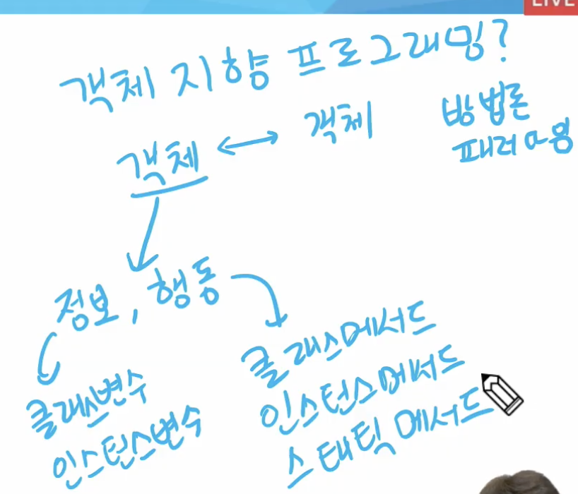
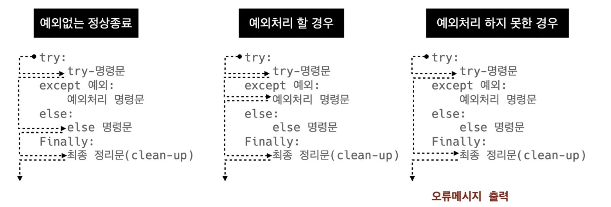

# 파이썬

---

## day08, 7월 27일 수요일

---

## 객체지향 프로그래밍

- 컴퓨터 프로그래밍의 패러다임(방법론) 중 하나이다.
- 컴퓨터 프로그램을 명령어의 목록으로 보는 시각에서 벗어나 여러개의 독립된 단위, 객체들의 모임으로 파악
- 각각의 개체는 메시지를 주고받고, 데이터를 처리할 수 있다.
- 프로그램을 여러 개의 독립된 객체들과 그 객체간의 상호작용으로 파악하는 프로그래밍 방법

- 정보와 행동이 있는건 모두 객체 - 변수 + 함수
- 데이터와 기능(메서드) 분리/  추상화된 구조(인터페이스)

### 객체지향 프로그래밍이 필요한 이유

- 현실 세계를 프로그램 설계에 반영(추상화)

### 객체지향 프로그래밍의 장점/단점

- 장점
  - 클래스 단위로 모듈화시켜 개발할 수 있으므로 많은 인원이 참여하는 대규모 소프트웨어 개발에 적합
  - 필요한 부분만 수정하기 쉽기 때문에 프로그램의 유지보수가 쉬움
- 단점
  - 설계시 많은 노력과 시간이 필요함(알고리즘 xx)
    - 다양한 객체들의 상호작용 구조를 만들기 위해 많은 시간과 노력이 필요
  - 실행 속도가 상대적으로 느림
    - 절차 지향 프로그래밍이 컴퓨터의 처리구조와 비슷해서 실행 속도가 빠름

**사람이 편하면 컴퓨터가 힘들다**

## OOP

### 객체

- 클래스에서 정의한 것을 토대로 메모리(실제 저장공간)에 할당된
- 클래스(설계도) - 가수. 머리속에만 존재. 실제론 존재 x
- 객체(실제 사례) - 이찬혁

### 객체와 인스턴스

- 클래스로 만든 객체를 인스턴스라고 함. 특정 클래스의 객체를 인스턴스라고 함.
- 이찬혁은 객체다(O)
- 이찬혁은 인스턴스다(X)
- 이찬혁은 가수의 인스턴스다(O)

클래스를 만든다 == 타입을 만든다.

**파이썬은 모든 것이 객체인 객체지향프로그래밍**

**파이썬의 모든 것은 속성과 행동이 존재**

Ex) [3,2,1].sort()

리스트.정렬()

객체.행동()

### 객체는 특정 타입의 인스턴스이다.

- 123, 900, 5는 모두 int의 인스턴스
- 'hello', 'bye'는 모두 string의 인스턴스
- [232,89,1], []은 모두 list의 인스턴스

### 객체의 특징

- 타입: 어떤 연산자와 조작이 가능한가?
- 속성: 어떤 상태를 가지는가?
- 조작법: 어떤 행위를 할 수 있는가?
- 객체 = 속성 + 기능

### 객체 비교하기

- ==
  - 동등한
  - 변수가 참조하는 객체가 동등한 경우 True
  - 두 객체가 같아 보이지만 동일한 대상을 가리키고 있다고 확인해 준 것은 아님
- is
  - 동일한
  - 두 변수가 동일한 객체를 가리키는 경우 True
  - 주소가 같다.

### 속성

- 같이 쓰는게 클래스 변수
- 따로 부여하는 인스턴스 변수

### 인스턴트 변수

- 인스턴스가 개인적으로 가지고 있는 속성
- 생성자 메서드(__init__)에서 self.name으로 정의
- 인스턴스가 생성된 이후 <instance>.<name>으로 접근 및 할당

### 클래스 변수

- 클래스.클래스변수 = 클래스변수값
- 인스턴스.클래스변수 = 클래스변수값
- 클래스 변수를 변경할 때는 항상 클래스.클래스 변수 형식으로 변경
- 인스터스에서 바꾸지 마라

### 메서드

- 특정 데이터 타입/클래스의 객체에 공통적으로 적용 가능한 행위(함수)
- 클래스 안에 있는 함수

- 메서드의 종류
  - 인스턴스 메서드 - 인스턴스 변수 처리
    - 호출 시, 첫번째 인자로 인스턴스 자기 자신(self)이 전달됨
    - Self - 인스턴스 자기 자신. 첫번째 인자로 자기 자신이 되도록 설계
  - 클래스 메서드 - 클래스 처리
  - 정적 메서드 - 나머지

- 매직메서드
  - __ 가 있는메서드는 특수한 동작을 위해 만들어진 메서드
  - 스페셜메서드 혹은 매직 메서드
  - 특정 상황에 자동으로 불리는 메서드
    - __ str __: 해당 객체의 출력 형태를 지정
    - __ gt __: 부등호 연산자(>, greater than)
    - __ del __: 인스턴스 객체가 소멸(파괴)되기 직전에 호출되는 메서드

- 클래스 메서드 활용
  - 클래스가 사용할 메서드
  - @classmethod: 데코레이터
  - 호출 시, 첫번째 인자로 클래스가 전달됨

- 스태틱 메서드
  - 인스턴스 변수, 클래스 변수를 전혀 다루지 않는 메서드
  - 속성을 다루지 않고 단지 기능(행동)만을 하는 메서드를 정의할 때 사용
  - 스태틱은 cls, self 사용x

## 객체지향의 핵심 4가지

- 추상화
  - **복잡한걸 숨기고, 필요한걸 나타냄**
  - 함수, 변수, 클래스
  - 현실 세계를 프로그램 설계에 반영. 복잡한 것은 숨기고 필요한 것만 들어내기
- 상속
  - **부모-자식 클래스 관계 -> 물려받기 -> 재사용**
  - 두 클래스 사이 부모 - 자식 관계를 정립하는 것
  - 모든 파이썬 클래스는 object를 상속 받음
- 다형성
  - **이름은 같은데, 동작은 다른 것 -> 오버라이딩 -> 부모 자식이 그대로(x) 자식이 변경**
  - 동일한 메서드가 클래스에 따라 다르게 행동할 수 있음을 의미
  - 서로 다른 클래스에 속해 있는 객체들이 동일한 메시지에 대해 다른 방식으로 응답할 수 있음
- 캡슐화
  - 민감한 정보를 숨기는 것
  - 객체의 일부 구현 내용에 대해 외부로부터 직접적인 액세스를 차단 ex 주민등록번호
  - 파이썬에서 암묵적으로 존재하지만, 언어적으로는 존재하지 않음.
  - Public Member
    - 언더바 없이 시작하는 메서드나 속성
    - 어디서나 호출이 가능, 하위 클래스 override 허용
    - 일반적으로 작성되는 메서드와 속성의 대다수를 차지
  - Protected Member
    - 언더바 1개로 시작하는 메서드나 속성
    - 암묵적 규칙에 의해 부모클래스 내부와 자식클래스에서만 호출 가능
  - Private Member
    - 언더바 2개로 시작하는 메서드나 속성
    - 본 클래스 내부에서만 사용 가능
    - 하위클래스 상속 및 호출 불가능 (오류)
    - 외부 호출 불가능 (오류)
  - 변에수에 접근할 수 있는 메서드를 별도로 생성
    - getter 메서드: 변수의 값을 읽는 메서드
      - @property 데코레이터 사용
    - setter메서드: 변수의 값을 설정하는 성격의 메서드
      - @변수.setter 사용

- 메서드 오버라이딩
  - 상속받은 메서드를 재정의
  - 부모 클래스의 메서드를 실행하고싶은 경우 super를 활용

## 디버깅

- 제어(조건/반복, 함수)가 되는 시점에서 디버깅이 자주 일어남

### Syntax Error 문법에러

- Invalid syntax - 문법 오류
- Assign to literal - 잘못된 할당
- EOL (End of Line), EOF (End of File)

### 예외 Exception

- ZeroDivisionError - 0으로 나누고자 할 때
- NameError - namespace 상에 이름이 없는 경우
- TypeError - 타입 불일치/argument 누락/argument 개수 초과/argument type 불일치
- VallueError - 타입은 올바르나 값이 적절하지 않거나 없는 경우
- IndexError - 인덱스가 존재하지 않거나 범위를 벗어나는 경우
- KeyError - 해당 키가 존재하지 않을 경우
- ModuleNotFoundError - 해당 모듈이 존재하지 않을 경우
- Import Error - Module은 있으나 존재하지 않는 클래스/함수를 가져오는 경우
- KeyboardInterrupt - 임의로 프로그램을 종료하였을 때
- IndentationError - Indentation(들여쓰기)이 적절하지 않는 경우
- 
- 에러 메시지 처리 (as)
  - as 키워드를 활용하여 원본 에러 메시지를 사용할 수 있음
    - 예외를 다른 이름에 대입

- try - 코드를 실행함

- except - try문에서 예외가 발생 시 실행함

- else - try문에서 예외가 발생하지 않으면 실행함

- finally - 예외 발생 여부와 관계없이 항상  실행함

  