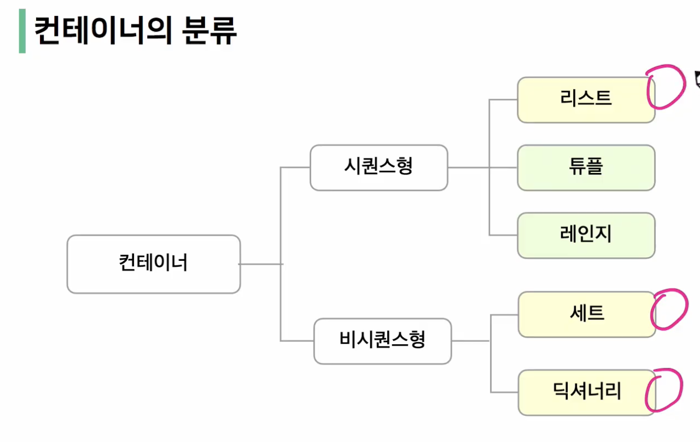
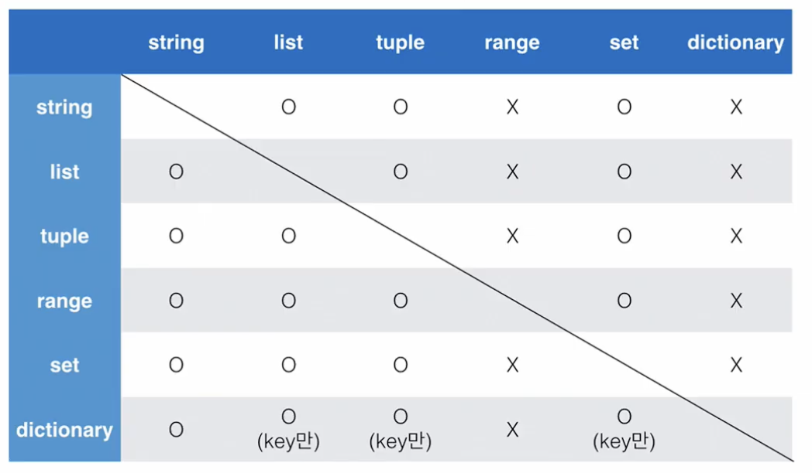

# 파이썬
---
## day01, 7월 18일 월요일
---
개념 구조화 하기 - 프로그래밍에서 개념을 명확히 알고, 그것을 구조화 하는 것이 중요!

- 개념의 정의
- 개념의 포함 관계
- 두 개념의 차이점

### 프로그래밍이란?

프로그램을 만드는 행위

프로그램 - 특정 작업을 수행하는 일련의 명령어들의 모음

### 프로그래밍 언어란?

컴퓨터에서 자신의 생각을 나타내고 전달하기 위해 사용하는 체계

기계어의 대안으로 사람이 이해할 수 있는 새로운 언어 개발 -> 프로그래밍 언어

특징 - 사람이 이해할 수 있는 문자

### 파이썬이란?

파이썬을 배워야하는 이유

1. 알고리즘 코딩 테스트에 유리
2. 구현 코딩 테스트에 유리
3. 가장 인기 많은 언어(AI 개발, 데이터 분석, 웹 프로그래밍, 업무자동화 등)

### 논리 연산자 주의할 점

- Falsy: False는 아니지만, False로 취급되는 다양한 값
  - 0, 0.0, (), [], {}, None, ""(빈 문자열)
- 논리 연산자도 우선 순위가 존재
  - not, and, or 순으로 우선순위가 높음

### 논리 연산자의 단축 평가

- 결과가 확실한 경우 두번째 값은 확인하지 않고 첫번째 값 반환
- and 연산에서 첫번째 값이 False인 경우 무조건 False -> 첫번째 값 반환
- Or 연산에서 첫번째 값이 True인 경우 무조건 True -> 첫번째 값 반환
- 0은 False, 1은 True

---

### 컨테이너

가변형 - 리스트, 세트, 딕셔너리

불변형 - 튜플, 레인지

**리스트**

- 여러 개의 값을 순서가 있는 구조로 저장하고 싶을 때 사용
- 리스트는 대괄호([ ])혹은 list()를 통해 생성
  - 파이썬에서는 어떠한 자료형도 저장 가능, 리스트 안에 리스트도 가능
  - 생성된 이후 내용 변경 가능 -> 가변 자료형
  - 파이썬에서 가장 흔히 사용
- 순서가 있는 시퀀스로 **인덱스**를 통해 접근 가능
  - 값에 대한 접근은 list[i]

**튜플**

- 소괄호(), 담고 있는 값 변경이 불가
- 단일 항목의 경우
  - 하나의 항목으로 구성된 튜플은 생성 시 값 뒤에 쉼표를 붙여야 함 ex) tuple_a = (1,)
- 복수 항목의 경우
  - 마지막 항목에 붙은 쉼표는 없어도 되지만, 넣는 것을 권장(Trailing comma) ex) tuple_b = (1, 2, 3,)

**Range**

- 숫자의 시퀀스를 나타내기 위해 사용
- 주로 반복문과 함께 사용됨
- 범위 및 스텝 지정: range(n,m,s)
  - n부터 m-1까지 s만큼 증가시키며 숫자의 시퀀스
- 시퀀스를 특정 단위로 슬라이싱
  - 인덱스와 콜론을 사용하여 문자열의 특정 부분만 잘라낼 수 있음
  - 슬라이싱을 이용하여 문자열을 나타낼 때 콜론을 기준으로 앞 인덱스에 해당하는 문자는 포함, 뒤 인덱스에 해당 문자는 미포함

셋(Set)

- 중복되는 요소가 없이, 순서에 상관없는 데이터들의 묶음
  - 순서가 없기 때문에 인덱스를 이용한 접근 불가능
- 수학에서의 집합을 표현한 컨테이너
  - 집합 연산이 가능(여집합을 표현하는 연산자는 별도 존재 X)
  - 중복된 값이 존재하지 않음
- 담고 있는 요소를 삽입 변경, 삭제 가능 -> 가변 자료형 (mutable)
- 중괄호({}) 혹은 set()을 통해 생성
  - 빈 set을 만들기 위해서는 set()을 반드시 활용해야함
- 순서가 없어 별도의 값에 접근할 수 없음
- 셋을 활용하면 중복된 값이 제거되지만 순서가 무시되므로 순서가 중요한 경우 사용할 수 없음
- 셋(Set) 연산자
  - | : 합집합
  - & : 교집합
  - "-" : 차집합
  - ^ : 대칭차집합(합집합 - 교집합)

**딕셔너리(Dictionary)**

- 키-값(key_value) 쌍으로 이뤄진 자료형(3.7 부터는 ordered, 이하 버전은 unordered)
- Dictionary의 키(key)
  - key는 변경 불가능한 데이터(immutable)만 활용 가능
    - string, integer, float, boolean, tuple, range
- 각 키의 값(values)
  - 어떠한 형태든 관계 없음
- 중괄호({}) 혹은 dict()을 통해 생성
- key를 통해 value에 접근

### 형변환

- 파이썬에서 데이터 형태는 서로 변환할 수 있음
- 암시적 형 변환(implicit)
  - 사용자가 의도하지 않고, 파이썬 내부적으로 자료형을 변환하는 경우
- 명시적 형 변환(Explicit)
  - 사용자가 특정 함수를 활용하여 의도적으로 자료형을 변환하는 경우

