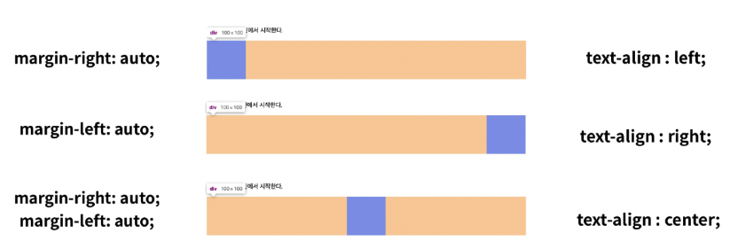

# Web

---

## day11, 8월 1일 월요일

---

## 웹 공부법

- 경험적으로 많이 쌓아야 한다
- 직접 실습해보며 익히는 방식

## 웹사이트

- 부라우저를 통해 접속하는 웹 페이지들의 모음
- 글, 그림, 동영상 등 여러 정보를 담고 있으며, 마우스로 클릭하면 다른 웹 페이지로 이동하는 링크들이 있음. 링크를 통해 여러 웹 페이지를 연결한 것을 웹 사이트라고 함.
- HTML(구조) / CSS(표현) / Javascript(동작)

- 웹사이트는 브라우저를 통해 작동함

## 웹 표준

- 웹에서 표준적으로 사용되는 기술이나 규칙
- 어떤 브라우저든 웹 페이지가 동일하게 보이도록 함(크로스 브라우징)

## HTML이란?

- Hyper Text Markup Language
- 웹 페이지를 작성하기 위한 언어
- 참조(하이퍼링크)를 통해 사용자가 한 문서에서 다른 문서로 즉시 접근할 수 있는 텍스트
- 마크업 스타일 가이드 (2 space)

## HTML 기본 구조

- html: 문서의 최상위(root) 요소
- Head: 문서 메타데이터 요소
  - 문서 제목, 인코딩, 스타일, 외부 파일 로딩 등
  - 일반적으로 브라우저에 나타나지 않는 내용
    - - < title> 브라우저 상단 타이틀
      - < meta> 문서 레벨 메타데이터 요소
      - < link> 외부 리소스 연결 요소(CSS파일, favicon 등)
      - < script> 스크립트 요소(JavaScript 파일/코드)
      - < style> CSS직접 작성
- Body: 문서 본문 요소
  - 실제 화면 구성과 관련된 내용
- 요소(element)
  - 태그와 내용으로 구성되어 있다.
    - 여는/시작 태그<h1> contents </h1> 닫는/종료 태그
    - 내용이 없는 태그들도 존재(닫는 태그가 없음)
      - Ex) br, hr, img, input, link, meta
  - 요소는 중첩(nested)될 수 있음
    - 요소의 중첩을 통해 하나의 문서를 구조화
    - 여는 태그와 닫는 태그의 쌍을 잘 확인해야함
      - 요류를 반환하는 것이 아닌 그냥 레이아웃이 깨진 상태로 출력되기 때문에, 디버깅이 힘들어질 수 있다.
- 속성(attribute)
  - 
  - 속성명: href, 속성값: 구글링크
  - 태그별로 사용할 수 있는 속성은 다르다.
  - 공백은 NO
  - 속성을 통해 태그의 부가적인 정보를 설정할 수 있음
  - 요소는 속성을 가질 수 있으며, 경로나 크기와 같은 추가적인 정보를 제공
  - 요소의 시작 태그에 작성하며 보통 이름과 값이 하나의 쌍으로 존재
  - 태그와 상관없이 사용 가능한 속성(HTML Global Attribute)들도 있음

HTML Global Attribute

- 모든 HTML 요소가 공통으로 사용할 수 있는 대표적인 속성
- 몇몇 요소에는 아무 효과가 없을 수 있음
  - id : 문서 전체에서 유일한 고유 식별자 지정
  - class : 공백으로 구분된 해당 요소의 클래스의 목록(CSS, JS에서 요소를 선택하거나 접근)
  - data-* : 페이지에 개인 사용자 정의 데이터를 저장하기 위해 사용
  - style : inline 스타일
  - title : 요소에 대한 추가 정보 지정
  - tabindex : 요소의 탭 순서

시맨틱 태그

- HTML태그가 특정 목적, 역할 및 의미적 가치(semantic value)를 가지는 것
  - ex h1 태그는 "이 페이지에서 최상위 제목"인 텍스트를 감싸는 역할을 나타냄
- Non sementic 요소로는 div, span 등이 있으며 a, form, table 들도 시맨틱 태그로 볼 수 있음.
- 의미론적 마크업
  - 개발자 및 사용자 뿐만 아니라 검색엔진 등에 의미 있는 정보의 그룹을 태그로 표현
  - 단순히 구역을 나누는 것 뿐만 아니라 '의미'를 가지는 태그들을 활용하기 위한 노력
  - 요소의 의미가 명확해지기 때문에 코드의 가독성을 높이고 유지보수를 쉽게 함
  - 검색 엔진 최적화(SEO)를 위해서 메타태그, 시멘틱 태그 등을 통한 마크업을 효과적으로 활용 해야함
- header : 문서 전체나 섹션의 헤더(머리말 부분)
- nav : 내비게이션
- aside : 사이드에 위치한 공간, 메인 콘텐츠와 관련성이 적은 콘텐츠
- section : 문서의 일반적인 구분, 콘텐츠의 그룹을 표현
- article : 문서, 페이지, 사이트 안에서 독립적으로 구분되는 영역
- footer : 문서 전체나 섹션의 푸터(파지막 부분)

렌더링(Rendering)

- 웹사이트 코드를 사용자가 보게 되는 웹사이트로 바꾸는 과정

DOM(Document Object Model)트리

- 텍스트 파일인 HTML 문서를 브라우저에 렌더링하기 위한 구조
  - HTML문서에 대한 모델을 구성함
  - HTML문서 내에 각 요소에 접근 / 수정에 필요한 프로퍼티와 메서드를 제공함

텍스트 요소

-  href 속성을 활용하여 다른 URL로 연결하는 하이퍼링크 생성
- <b></b>, <strong></strong> **굵은 글씨 요소**
- <i></i>, <em></em> *기울임 글씨 요소*
-   텍스트 내에 줄 바꿈 생성
-  src 속성을 활용하여 이미지 표현
-  의미 없는 인라인 컨테이너

그룹 컨텐츠

- < p>
 하나의 문단(paragraph)
- < hr> 문단 레벨 요소에서 주제의 분리를 의미하며 수평선으로 표현됨 (A Horizontal Rule)
- < ol></ol> 순서가 있는 리스트
- < ul></ul> 순서가 없는 리스트
- < pre></pre> HTML에 작성한 내용을 그대로 표현. 보통 고정 글꼴이 사용되고 공백 문자를 유지
- < blockquote></blockquote> 텍스트가 긴 인용문, 주로 들여쓰기를 한 것으로 표현됨
- < div>
 의미없는 블록 레벨 컨테이너

인라인/블록요소

- 인라인 요소는 글자처럼 취급	
- 블록 요소는 한 줄 모두 사용

## form (ex) 로그인창)

- 정보(데이터)를 서버에 제출하기 위해 사용하는 태그
- 기본속성
  - Action: form을 처리할 서버의 URL(데이터를 보낼 곳) (ex 네이버, 구글)
  - Method: form을 제출할 때 사용할 HTTP 메서드 (GET 혹은 POST)
  - Enctype: method가 post인 경우 데이터의 유형
    - 기본값
    - 파일 전송시

## input

- 다양한 타입을 가지는 입력 데이터 유형과 위젯이 제공됨
- <input> 대표적 속성
  - name: form control에 적용되는 이름(이름/값 페어로 전송됨)
  - value: form control에 적용되는 값(이름/값 페어로 전송됨)
  - Required, readonly, autofocus, autocomplete, disabled 등

- label을 클릭하여 input 자체의 초점을 맞추거나 활성화 시킬 수 있음
- input에 속성을, label에 for 속성을 활용하여 상호 연관을 시킴

## CSS

- Cascading Style Sheets
- 스타일을 지정하기 위한 언어. 선택하고, 스타일을 지정한다.
- 선택자로 선택, 선언;속성:값

### CSS 정의 방법

- 인라인(inline) - 한줄로
- 내부 참조(embedding) - <style> - 딕셔너리처럼
- 외부 참조(link file) - 분리된 CSS 파일

### CSS 선택자 정리

- 요소 선택자
  - HTML 태그를 직접 선택
- 클래스(class) 선택자
  - 마침표(.)문자로 시작하며, 해당 클래스가 적용된 항목을 선택
- 아이디(id) 선택자
  - #문자로 시작하며, 해당 아이디가 적용된 항목을 선택
  - 일반적으로 하나의 문서에 1번만 사용
  - 여러번 사용해도 동작하지만, 단일 id를 사용하는 것을 권장

### CSS적용 우선순위(cascading order)

- 우선순위를 아래와 같이 그룹을 지어볼 수 있다.
  - 1. 중요도(Importance) - 사용시 주의
       - !important
    2. 우선순위(Specificity)
       - 인라인 -> id -> class, 속성, pseudo-class -> 요소, pseudo-element
    3. CSS파일 로딩 순서

### CSS 상속

- 부모 요소의 속성을 자식에게 상속
  - 상속 되는 것들
  - ex) Text 관련 요소(font, color, text-align), opacity, visibility 등
  - 상속 되지 않는 것 예시
  - ex) Box model 관련 요소(width, height, margin, padding, border, box-sizing, display), position 관련 요소(position, top/right/bottom/left, z-index) 등

### 크기단위

- px (픽셀)
  - 모니터 해상도의 한 화소인 '픽셀' 기준
  - 픽셀의 크기는 변하지 않기 때문에 고정적인 단위
- %
  - 백분율 단위
  - 가변적인 레이아웃에서 자주 사용
- em
  - (바로 위, 부모 요소에 대한) 상속의 영향을 받음
  - 배수 단위, 요소에 지정된 사이즈에 상대적인 사이즈를 가짐
- rem
  - (바로 위, 부모 요소에 대한) 상속의 영향을 받지 않음
  - 최상위 요소(html)의 사이즈를 기준으로 배수 단위를 가짐

- 크기 단위(viewport)

  - 웹 페이지를 방문한 유저에게 바로 보이게 되는 웹 컨텐츠의 영역(디바이스 화면)
  - 디바이스의 viewport를 기준으로 상대적인 사이즈가 결정됨
  - vw, vh, vmin, vmax
  - px는 브라우저의 크기를 변경해도 그대로, vx는 브라우저의 크기에 따라 크기가 변함

  

### 색상단위

- 색상키워드
- RGB색상
  - '#' + 16진수 표기법
  - rgb() 함수형 표기법
- HSL색상
  - 색상, 채도, 명도
- a는 alpha 투명도

### CSS 문서 표현

- 텍스트
  - 서체(font-family), 서체 스타일(font-style, font-weight등)
  - 자간(letter-spacing), 단어 간격(word-spacing), 행간(line-height) 등
  - 컬러(color), 배경(background-image, background-color)
  - 기타 HTML 태그별 스타일링
    - 목록(li), 표(table)

### 결합자

- 자손 결합자
  - selectorA 하위의 모든 selectorB 요소
- 자식 결합자
  - selectorA 바로 아래의 selectorB 요소
- 일반 형제 결합자(~)
  - selectorA의 형제 요소 중 뒤에 일치하는 selectorB 요소를 모두 선택
- 인접 형제 결합자(+)
  - selectorA의 형제 요소 중 바로 뒤에 위치하는 selectorB 요소를 선택

## Boxmodel 구성

### 모든 요소는 네모(박스모델)이고, 위에서 아래, 왼쪽에서 오른쪽으로 쌓인다.

- Margin
  - 테두리 바깥의 외부 여백. 배경색을 지정할 수 없다.
- border
  - 테두리 영역
- padding
  - 테두리 안쪽의 내부 영역. 요소에 적용된 배경색, 이미지는 padding까지 적용
- content
  - 글이나 이미지 등 요소의 실제 내용

## CSS Display

- 모든 요소는 네모(박스모델)이고, 좌측 상단에 배치.
- display에 따라 크기와 배치가 달라진다.
- display : block
  - 줄 바꿈이 일어나는 요소
  - 화면 크기 전체의 가로 폭을 차지한다.
  - 블록 레벨 요소 안에 인라인 레벨 요소가 들어갈 수 있음
- display: inline
  - 줄 바꿈이 일어나지 않는 행의 일부 요소
  - content 너비만큼 가로 폭을 차지한다.
  - width, height, margin-top, margin-bottom을 지정할 수 없다.
  - 상하 여백은 line-height로 지정한다.

- 대표적인 블록 레벨 요소
  - div / ul, ol, li / p / hr / form 등
- 대표적인 인라인 레벨 요소
  - span /  a / img / input, label / b, em, i, strong 등

 block의 기본 너비는 가질 수 있는 너비의 100%

- 속성에 따른 수평 정렬

- display: inline-block
  - block과 inline 레벨 요소의 특징을 모두 가짐
  - inline처럼 한 줄에 표시할 수 있고, block처럼 width, height, margin 속성을 모두 지정할 수 있음
- display: none
  - 해당 요소를 화면에 표시하지 않고, 공간조차 부여되지  않음
  - 이와 비슷한 visibility: hidden은 해당 요소가 공간은 차지하나 화면에 표시만 하지 않는다.

## CSS Position

- 문서 상에서 요소의 위치를 지정
- Static : 모든 태그의 기본 값(기준 위치)
  - 일반적인 요소의 배치 순서에 따름(좌측 상단)
  - 부모 요소 내에서 배치될 때는 부모 요소의 위치를 기준으로 배치 됨
- 아래는 좌표 프로퍼티(top, bottom, left, right)
  1. relative: 상대 위치
     - 자기 자신의 static 위치를 기준으로 이동(normal flow 유지)
     - 레이아웃에서 요소가 차지하는 공간은 static일 때와 같음(normal position 대비 offset)
  2. absolute: 절대 위치
     - 요소를 일반적인 문서 흐름에서 제거 후 레이아웃 공간을 차지하지 않음(normal flow에서 벗어남)
     - static이 아닌 가장 가까이에 있는 부모/조상 요소를 기준으로 이동(없는 경우 브라우저 화면 기준으로 이동)
  3. Fixed: 고정위치
     - 요소를 일반적인 문서 흐름에서 제거 후 레이아웃에 공간을 차지하지 않음 (normal flow에서 벗어남)
     - 부모 요소와 관계없이 viewport를 기준으로 이동
       - 스크롤 시에도 항상 같은 곳에 위치함
  4. sticky: 스크롤에 따라 static -> fixed로 변경
     - 속성을 적용한 박스는 평소에 문서 안에서 position: static 상태와 같이 일반적인 흐름에 따르지만 스크롤 위치가 임계점에 이르면 position: fixed와 같이 박스를 화면에 고정할 수 있는 속성