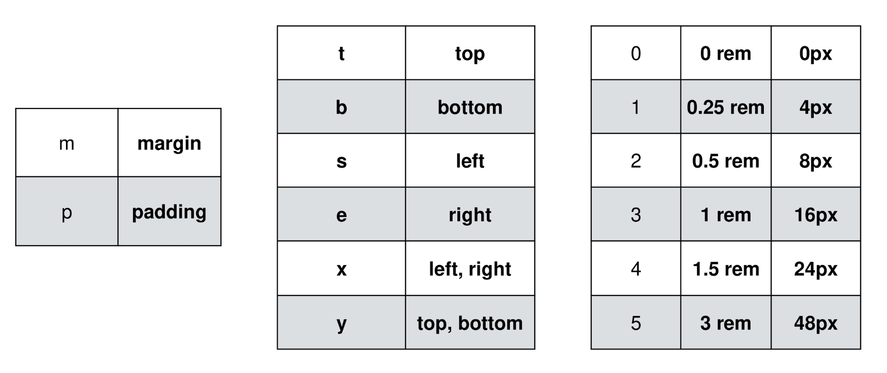
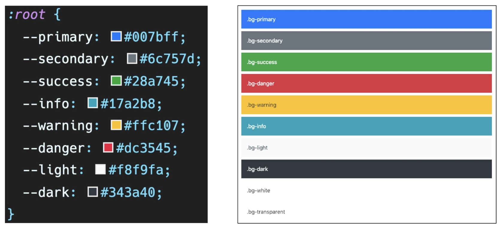

# Web

---

## Day13, 8월 3일 수요일

---

## CSS Layout

- Display
- Position
- Float
- Flexbox
- Grid

### Float

- 박스를 왼쪽 혹은 오른쪽으로 이동시켜 텍스트를 포함 인라인 요소들이 주변을 Wrapping 하도록 함
- 요소가 Normal flow를 벗어나도록 함
- none 기본값
- left 요소를 왼쪽으로 띄움
- right 요소를 오른쪽으로 띄움

### flexbox

- 행과 열 상태로 아이템을 배치하는 1차원 레이아웃 모델
- 축
  - Main axis(메인 축)
  - cross axis(교차 축)
- 구성 요소
  - Flex Container (부모 요소)
    - Flex box 레이아웃을 형성하는 가장 기본적인 모델
    - Flex Item들이 놓여있는 영역
    - display 속성을 flex 혹은 inline-flex로 지정
  - Flex Item (자식 요소)
    - 컨테이너에 속해 있는 컨텐츠(박스)
- Flexbox 축
  - flex-direction: row

### CSS Flexible Box Layout

(수동 값 부여 없이)

1. 수직 정렬
2. 아이템의 너비와 높이 혹은 간격을 동일하게 배치

부모 요소에 display: flex 혹은 inline-flex

### Flex 속성

- 배치 설정

  - flex-direction
    - Row ->, row-reverse <-,
    - Column 위->아래, column-reverse 아래->위
  - flex-wrap
    - wrap(넘치면 그 다음줄), no wrap(한 줄에 배치)
  - Flex-flow
    - Flex-flow : row nowrap

- 공간 나누기

  - Justify-content (main axis)
    - Flex-start, flex-end, center, space-between, space-around, space-evenly
  - Align-content (cross axis)
    - Flex-start, flex-end, center, space-between, space-around, space-evenly
  - Flex-start: 아이템들을 axis 시작점으로
  - Flex-end: 아이템들을 axis 끝 쪽으로
  - Center: 아이템들을 axis 중앙으로
  - Space-between: 아이템 사이의 간격을 균일하게 분배
  - Space-around: 아이템을 둘러싼 영역을 균일하게 분배
  - Space-evenly: 전체 영역에서 아이템 간 간격을 균일하게 분배

- 정렬

  - Align-items (모든 아이템을 cross axis 기준으로)
  - Align-self (개별 아이템)
    - stretch(기본값): 컨테이너를 가득 채움
    - flex-start: cross axis를 중심으로 위
    - Flex-end: cross axis를 중심으로 아래
    - Center: cross axis를 중심으로 가운데
    - baseline: 텍스트 baseline에 기준선을 맞춤

  - Flex-grow: 남은 영역을 아이템에 분배

## Bootstrap

- CDN: 컨텐츠(CSS, JS, Image, Text 등)을 효율적으로 전달하기 위해 여러 노드에 가진 네트워크에 데이터를 제공하는 시스템

### Spacing

{property}{sides}-{size}

mt-3

- property:
  - m- margin
  - p- padding
- sides:
  - t- top
  - b- bottom
  - x- 가로
  - y- 세로
  - s- start
  - e- end
- Size:
  - 0: 0
  - 1: 0.25
  - 2: 0.5
  - 3: 1
  - 4: 1.5
  - 5: 3
  - auto: 자동
  - 1rem=16px

### color

### buttons 

- btn, btn-primary

### Dropdowns

- dropdown
- dropdown-menu
- dropdown-item

### Forms > Form controls

### Navbar -네비게이션 바

### Carousel -슬라이드 쇼

### Modal -긴급상황 전달

